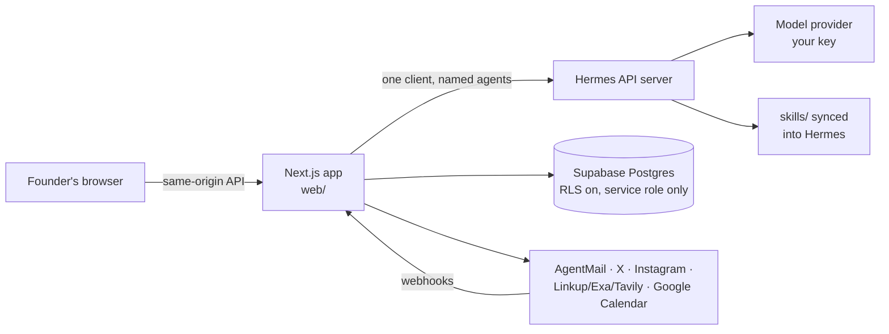
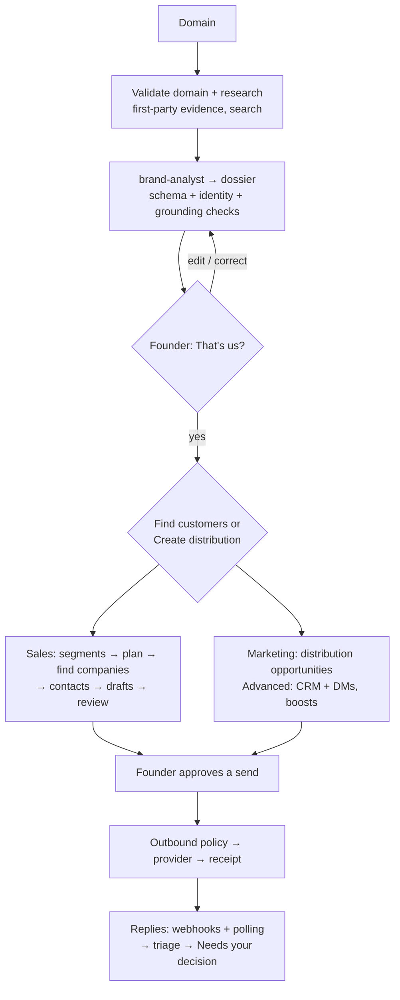

# Architecture

How Kami turns a founder's domain into reviewed, real go-to-market actions. Product behaviour lives in [product-loops.md](product-loops.md); coding rules in [AGENTS.md](../AGENTS.md); setup in [SETUP.md](../SETUP.md).

## 1. Shape of the system

| Layer | Responsibility |
|---|---|
| **Next.js app** (`web/`) | UI, the workflow that sequences steps, every policy gate, every integration |
| **Hermes** | Runs agents: role prompt + skills + tools (web search, extraction, delegation) |
| **agents/** | One role prompt per agent, sent as the system message (Hermes layers it on its own core prompt) |
| **skills/** | Playbooks agents apply, synced into Hermes with `npm run sync:skills` |
| **Supabase** | The only state store |

## 2. Why a workflow, not an autonomous manager

The product is a gated loop: *recommend → confirm → act → learn → escalate*, with the founder approving between steps. Steps whose order is known are a **deterministic workflow owned by the app**; each step runs **one named agent** and validates its output before using it. Two steps are open-ended and run as Hermes orchestrators that use `delegate_task`: **Kami Guide** (questions) and the **Distribution manager** (one platform specialist per surface, in parallel). Neither can act on the world — they return proposals the founder approves.

This keeps the parts that must be reliable (approvals, the kill switch, suppression, sending) in testable code, and the parts that need judgment (research, positioning, drafting, triage) in agents.

## 3. The workflow

| Step | Agent | Service |
|---|---|---|
| Dossier | `brand-analyst` | `lib/campaigns/dossier.ts` |
| Segments, plan | `sales-strategist` | `lib/salesSegments.ts`, `lib/salesStrategy.ts` |
| Companies, contacts, signals | `sales-researcher` | `lib/salesResearch.ts`, `lib/salesContactFinder.ts` |
| Email drafts | `outreach` | `lib/sales/` (sequences) |
| Reply triage | `sales-conversation-manager` | `lib/inbound/salesReplies.ts` |
| Distribution plan + opportunities | `distribution-manager` (orchestrator) → `distribution-platform-specialist` per surface; `marketing-strategist` shapes the angle | `lib/distributionManager.ts`, `lib/distributionResearch.ts` |
| CRM ranking | `marketing-researcher` | `lib/marketingDiscover.ts` |
| DM suggestions | `dm-assistant` | `lib/marketing/` |
| Kami Guide | `guide` (orchestrator) | `lib/guide/guide.ts` |

Steps with a deterministic fallback (plan scaffold, dossier-derived segments, template drafts) use it when Hermes is unavailable and label the result as a fallback in the UI.

## 4. Calling Hermes

All calls go through `web/lib/hermes/client.ts`:

- **`runAgentJson({ agent, kind, input, schema })`** — structured output validated against a zod schema from `lib/domain/`. If validation fails (including identity and grounding checks expressed in the schema), the agent gets one corrective retry with the exact problems.
- **`completeOrNull`** — for steps with a deterministic fallback.
- **`streamResponse`** — server-sent events (Kami Guide).

Every call uses a Hermes session id `kami-<campaign>-<agent>-<run>`: runs never share history by accident, yet Hermes' own state can be filtered per campaign (Activity → Hermes). Kami Guide uses one session per campaign for conversational continuity. Every call is logged to `agent_run_logs` (Activity → Agent runs) and traced to Langfuse when configured.

## 5. Real-world actions

Every send, post and DM goes through `web/lib/outbound/`:

1. **Kill switch and area pause** — `agent_sessions.paused` plus the Sales/Marketing/Distribution pause.
2. **Suppression list** — one `suppressions` table (per campaign or global, per channel or all).
3. **Approvals and review** — e.g. a sales email needs a passing review rubric and the founder's approval; the first send of a campaign can require explicit approval; daily caps apply.
4. **Claim a receipt** — insert into `outbound_receipts` under a unique idempotency key *before* calling the provider. A double click or retry finds the claim; idempotent providers (AgentMail) retry safely, others report "outcome unknown" instead of sending twice.
5. **Provider call** through a port (`lib/ports/`) and adapter (`lib/adapters/`).
6. **Record the provider id** — `status = 'sent'` requires it (database check constraint). A 200 alone is not proof.

Recipients always come from stored contacts. Kami never constructs an email address.

## 6. Inbound

| Channel | Mechanism |
|---|---|
| Email replies | AgentMail webhook (Svix-signed) → `ingestInboundEmail`; polling job as fallback |
| X DM replies | Polling job (`dm.read`) |
| Instagram DM replies | Meta webhook (`X-Hub-Signature-256`) |

Replies are matched to the outbound thread, de-duplicated by provider id, classified, and surfaced under **Needs your decision**. Unsubscribes add a suppression immediately. Kami never answers on its own.

Jobs run from `/api/jobs/*` (cron secret) or the optional in-process scheduler (`KAMI_SCHEDULER=on`).

## 7. Security model (Community Edition)

Single user, self-hosted:

- **Access** (`proxy.ts`): without `KAMI_ADMIN_TOKEN` the app only serves loopback hosts; with it, every request needs the admin cookie (from `/login`) or a bearer token. Jobs accept `KAMI_CRON_SECRET`; webhooks verify signatures. Cross-site state-changing requests are rejected.
- **Data**: row-level security is enabled on every table with no policies, so the public anon key reads nothing; the server uses the service-role key.
- **Secrets**: OAuth tokens are sealed with AES-256-GCM (`KAMI_TOKEN_ENCRYPTION_KEY`); tokens never reach the browser.
- **Input**: every route validates with zod; every query is scoped to the campaign session.

## 8. Code map

| Path | Role |
|---|---|
| `web/app/api/**` | Thin routes |
| `web/lib/campaigns/` | Sessions, research, dossier, context pack |
| `web/lib/sales/`, `web/lib/marketing/` | Feature services |
| `web/lib/outbound/`, `web/lib/inbound/` | Sending and replies |
| `web/lib/hermes/` | Hermes client, agent registry, JSON parsing, SSE |
| `web/lib/ports/`, `web/lib/adapters/`, `web/lib/providers.ts` | Vendor boundaries |
| `web/lib/domain/` | Schemas and types shared with the browser |
| `web/supabase/migrations/` | Schema |
| `agents/`, `skills/` | Agent roles and playbooks |
